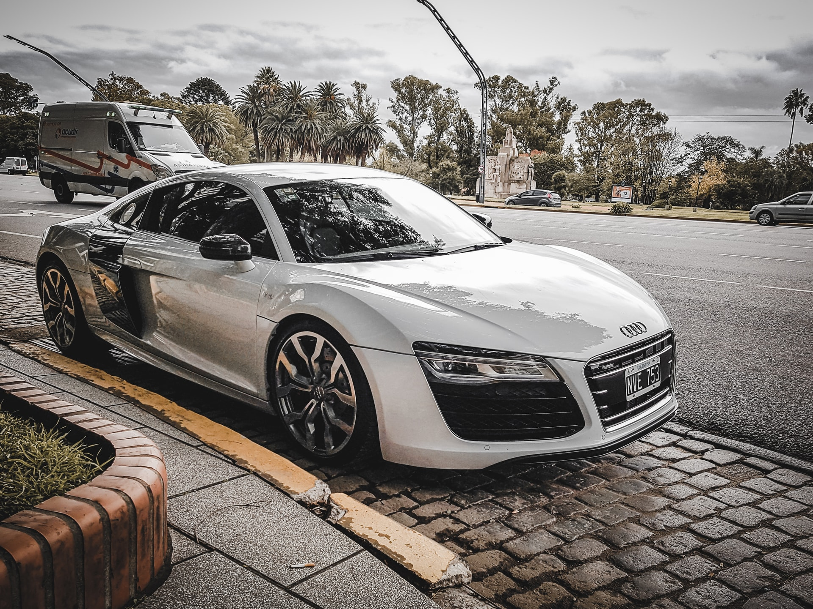

# js_web
js實作應用

<!-- data-slider-duration="2000"  自動撥放時間-->
<!-- 輪播圖項目：根據需求複製貼上 active 只有一組 -->

        

            
            <h1>AUDI</h1>
        

        

            
            <h1>TESLA</h1>
            <!-- 

 -->
        

        

            
            <h1>PORSCHE</h1>
        

        

        

        

            

            

            

        
